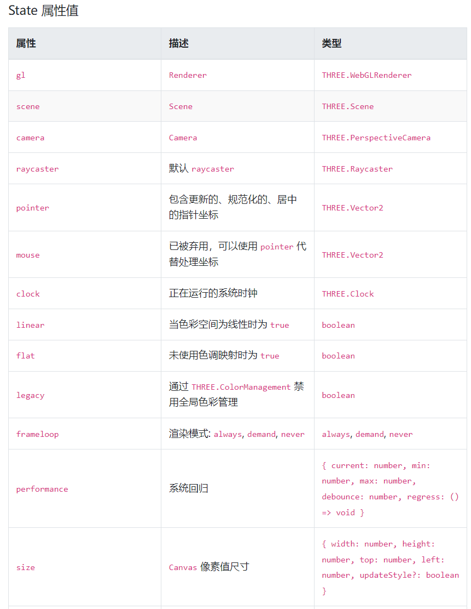
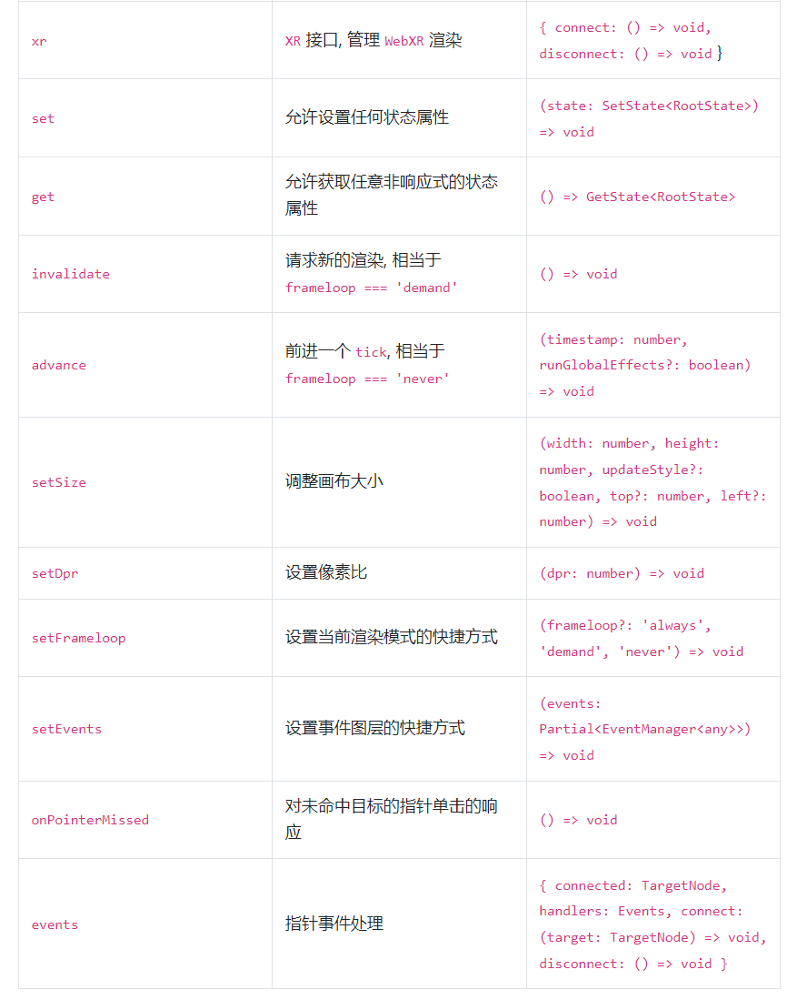

#React-Three-Fiber

## 一、概念

######React Three Fiber是把three.js进行了再封装，使用起来更方便，语法则就是react的jsx语法糖。

##二、实现
####1. 以React框架为例，我们需要先引入React-Three-Fiber

```java
import { Canvas } from "@react-three/fiber";
```
####1. 创建一个场景，并在场景中添加元素

```jsx
<Canvas>
    // 网格
    <mesh>
        // 几何体
        <boxGeometry />
        // 材质
        <meshStandardMaterial />
    </mesh>
</Canvas>
```

其中```<mesh />```等同于new THREE.Mesh();
```<boxGeometry />```和```<meshStandardMaterial />```会自动附加到其父级mesh上创建一个新网格。

**如有多个物体，可以用group来包住mesh**

```jsx
<Canvas>
    <group>
        <mesh>
            <sphereGeometry />
            <meshStandardMaterial color="#00c8ff" />
        </mesh>

        <mesh>
            <boxGeometry />
            <meshStandardMaterial color="#0f0" />
        </mesh>
    </group>
</Canvas>
```

#####此时则完成了一个完整的3D场景的创建，相比于原生Three.JS代码更简洁。

**注意**：
1. `<Canvas />`组件内部只能包含Three.js中存在的对象，不能包含H5标签以及一些自定义组件。
2. 灯光、控制器等对象，必须写在`<Canvas />`下一级，不能写在`<mesh />`内。

## 三、光源

光源其实和Three.js中的类型都是一样的，只不过是Fiber给封装成了组件形式，配置变成组件的属性。下面只介绍几种光源写法。

```jsx
 // 环境光 
 <ambientLight intensity={1.5} /> // intensity 光照强度
 // 平行光
 <directionalLight position={[1, 2, 3]} intensity={1.5} /> // postion 光照位置
 // 点光源
 <pointLight position={[-10, -10, -10]} decay={0} intensity={Math.PI} /> // decay 光源衰减量
 // 聚光灯
 <spotLight
    position={[10, 10, 10]}
    angle={0.15} // 角度
    penumbra={1} // 边缘模糊程度
    decay={0}
    intensity={Math.PI}
/>
```

##四、hooks函数

###useFrame
useFrame 是 react-three-fiber 的标准动画钩子,此函数在共享渲染循环内以本机刷新率运行。可以实现一下物体的动画等效果。

**注意：在 useFrame 中不能使用 setState 更新状态值！**
 
#####1. 首先我们先借助React中useRef来绑定物体
   
```java
import { useRef } from "react";
import { Canvas, useFrame } from "@react-three/fiber"; // 导入useFrame

const Cube = () => {
    const mesh = useRef();

    // 实现立方图沿x轴旋转动画
    useFrame((state, delta) => (mesh.current.rotation.x += delta)); // useFrame内参数中包含场景、摄像机等详细信息

    return (
        <mesh ref={mesh}> // 设置上ref
            <boxGeometry args={[1, 1, 1]} /> // arg 长宽高1 1 1
            <meshStandardMaterial />
        </mesh>
    )
}

const App = () => {
    return (
        <Canvas>
            <Cube />
        </Canvas>
    )
}

export default App;
```

#####2. 控制渲染循序
如果你需要更多的控制，你可以传递一个数字渲染优先级值。这将导致 React Three Fiber 完全禁用自动渲染。现在，渲染顺序将由我们自己控制，这在后期渲染通道处理以及在多个视图渲染的场景下非常有用。

```java
function Render() {
  // 控制渲染顺序
  useFrame(({ gl, scene, camera }) => {
    gl.render(scene, camera)
}, 1)

function RenderOnTop() {
  // 这里将在上面 Render 方法的 useFrame 之后执行。
  useFrame(({ gl, ... }) => {
    gl.render(...)
}, 2)
```
***回调将按优先级值的升序（最低在前，最高在后）执行，类似于 DOM 的层级顺序。***

#####3. 负索引
使用负索引无法接管渲染循环控制，但如果确实必须对组件树中的 useFrame 序列进行排序，使用负索引将很有用。

```java
function A() {
  // 此处将先执行
  useFrame(() => ..., -2)

function B() {
  // 此处将在A的 useFrame 之后执行
  useFrame(() => ..., -1)
```

###useThree
此 hook 允许访问的状态模型包括默认渲染器 renderer 、场景 scene、相机 camera 等。它还提当前画布 canvas 在屏幕和视区中的坐标位置大小。它是动态自适应的，如果调整浏览器大小，将返回新的测量值，它适用于所有可能更改的状态对象。

```java
import { useThree } from '@react-three/fiber'

function Foo() {
  const state = useThree()
}
```





1. OrbitControls 
2. TransformControls makeDefault mode
3. PivotControls
4. Html
5. text
6. float
7. meshReflectorMaterial